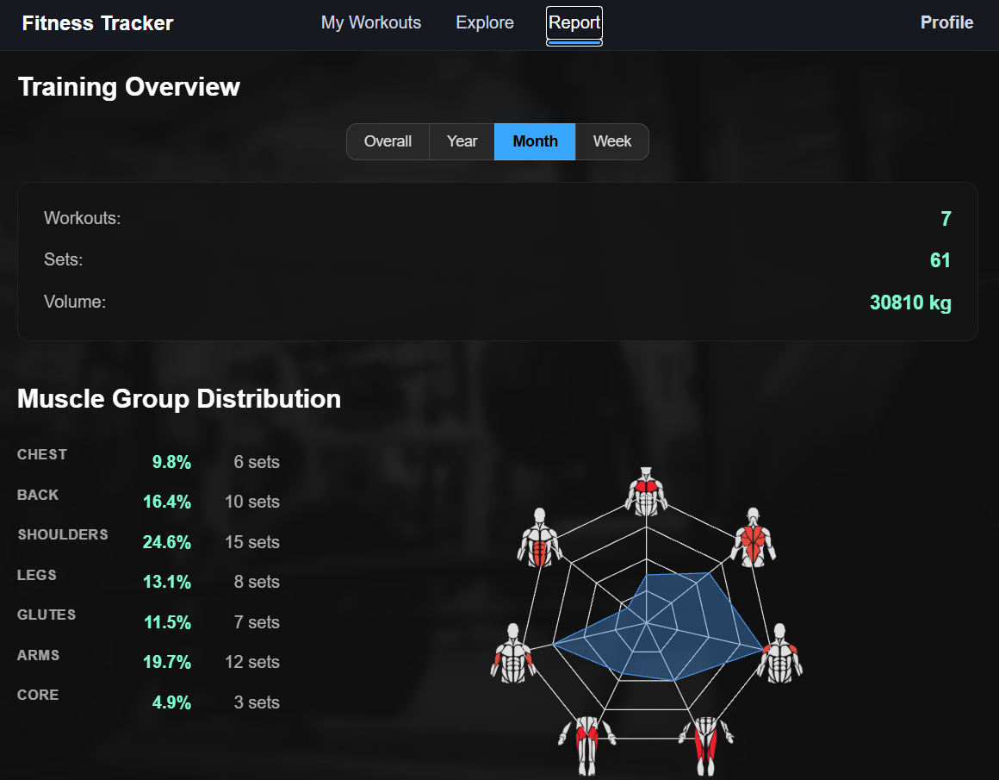
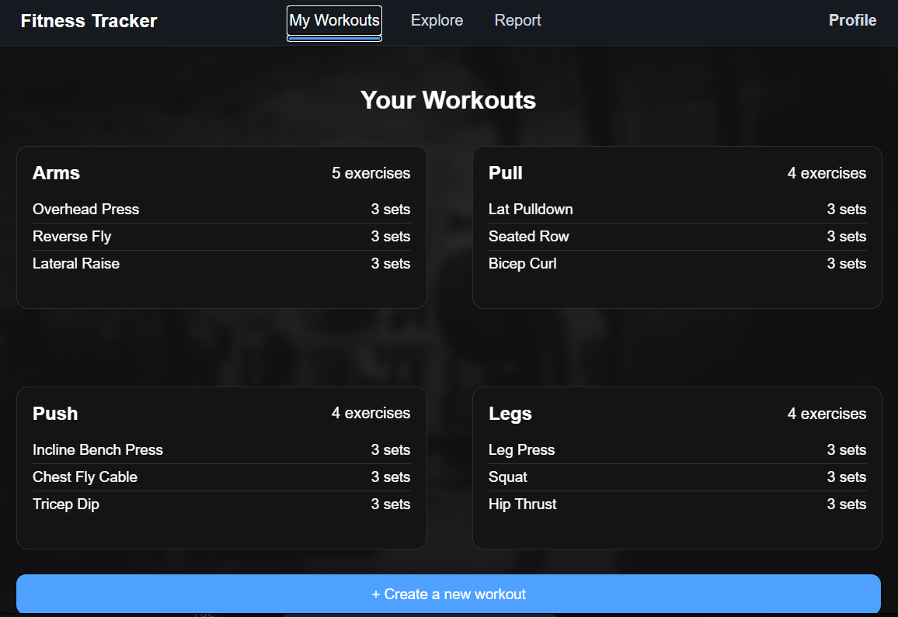
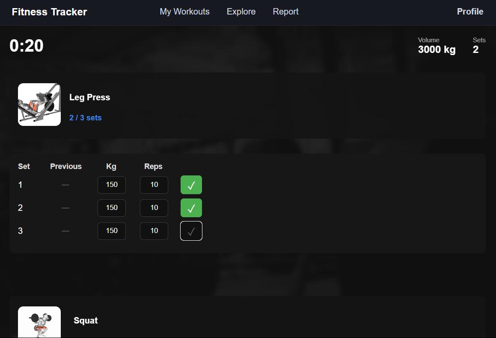
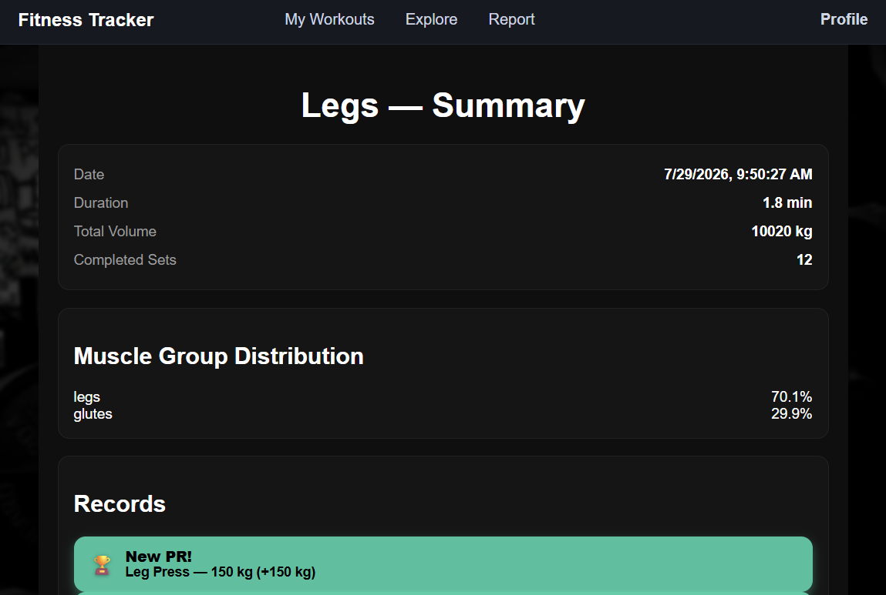
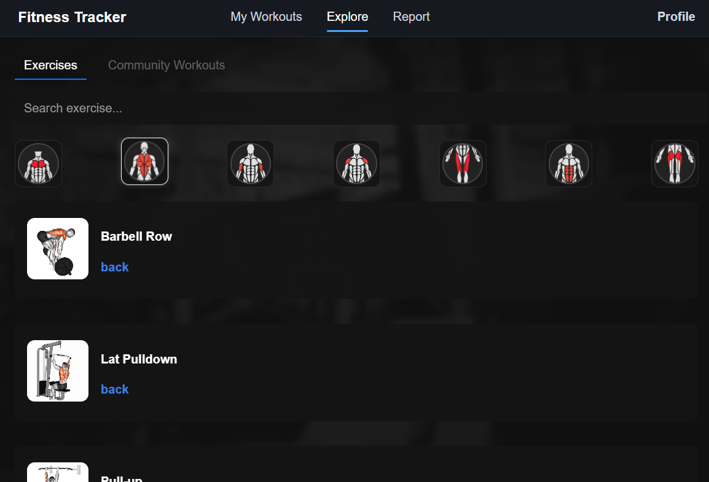
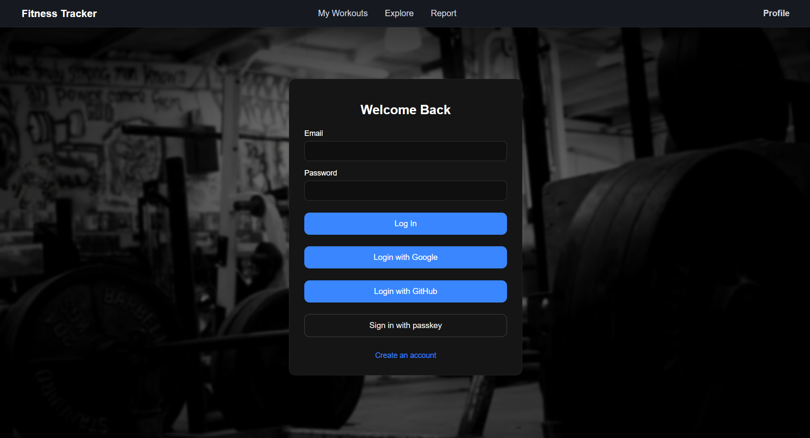

# Fitness Tracker

A full-stack fitness tracker I built as a university project. You can plan workouts, log training sessions, browse an exercise catalogue, and see how your training is spread across muscle groups. There's a web app and a mobile app, and both talk to the same backend.

The part I spent the most time on is authentication: besides the usual email \+ password, you can also sign in with GitHub, with Google, or with a passkey. More on that below.

The app and this README are in English.

## What it does

- Plan and manage workouts, and log training sessions.

  
  
  

- A workout history so you can look back at past sessions.
- An exercise catalogue (seeded into the database) with an image per muscle group. 
- A breakdown of how your training splits across muscle groups, drawn as charts.
- Four ways to sign in — email \+ password, GitHub (OAuth), Google (OIDC) or a passkey (WebAuthn). GitHub sign-in can also be linked to an existing account.
- A web app and a React Native mobile app, both on the same backend API.

## Tech stack

**Backend** (`backend/`)

- Node \+ Express (TypeScript)
- MongoDB with Mongoose
- Session-based auth using express-session (an httpOnly cookie); passwords hashed with bcrypt
- GitHub OAuth written by hand, Google via `openid-client` (OIDC), passkeys via `@simplewebauthn/server`

I kept all four sign-in methods resolving into the same session, so the rest of the API doesn't have to care how you logged in.

**Web frontend** (`frontend/`)

- React \+ TypeScript, built with Vite
- Bootstrap for styling, Recharts for the muscle-group charts
- React Router for routing; talks to the backend with `fetch`, sending the session cookie

**Mobile app** (`mobile/fitness-mobile/`)

- React Native with Expo
- React Navigation (bottom tabs \+ stacks), React Native Paper for the UI
- axios for the API calls — the same endpoints the web app uses

## Project structure

backend/ Express API — MongoDB models, auth, routes

frontend/ React web app (Vite)

mobile/fitness-mobile/ React Native app (Expo)

## Running it locally

You'll need:

- Node (the Docker images use Node 20\)
- A MongoDB database — a local `mongod` is fine. The default connection is `mongodb://127.0.0.1:27017/fitness-app`.
- Optional: GitHub and Google OAuth credentials, only if you want to try those sign-in methods. Email/password and passkeys work without them.

**1\. Backend**

cd backend

npm install

cp .env.example .env \# fill in what you need (see below)

npm run dev \# API on http://localhost:4000

The variables in `.env`: `MONGO_URI`, `SESSION_SECRET`, and — only for social login — `GOOGLE_CLIENT_ID` / `GOOGLE_CLIENT_SECRET` / `OIDC_REDIRECT_URL` for Google, and `GITHUB_CLIENT_ID` / `GITHUB_CLIENT_SECRET` / `GITHUB_REDIRECT_URL` for GitHub. Passkeys use `RP_ID` (defaults to `localhost`). See `backend/.env.example` for the full list.

To fill the exercise catalogue there's a seed script at `src/scripts/seedExercises.ts`:

npm run seed

**2\. Web frontend**

cd frontend

npm install

cp .env.example .env \# VITE_API_BASE=http://localhost:4000

npm run dev \# web app on http://localhost:5173

The backend only allows CORS from `localhost:5173`, so use that port in development.

**3\. Mobile app** (optional)

cd mobile/fitness-mobile

npm install

npx expo start

Point the API base at your machine — note that the Android emulator reaches your host through `10.0.2.2` rather than `localhost`.

## Authentication

This is the part I put the most into, so a little more detail. All four methods end up creating the same server-side session (the `fitnessapp.sid` cookie):

- **Email \+ password** — passwords hashed with bcrypt.
- **GitHub (OAuth)** — the flow is hand-written (`/api/auth/oauth/github/…`); you can log in with GitHub or link it to an existing account.
- **Google (OIDC)** — via `openid-client`, using Google's OIDC configuration.
- **Passkeys (WebAuthn)** — via `@simplewebauthn/server`, so you can register and sign in with a device passkey.

## Docker

Both apps ship with a Dockerfile:

- `backend/Dockerfile` builds the TypeScript and runs the API on port 4000\.
- `frontend/Dockerfile` builds the web app and serves the static files with nginx on port 80\.

There's no compose file — you build and run the two images separately, or add a `docker-compose.yml` if you'd like them to come up together.

## Author

Daniel Schukin — university project, Hochschule Koblenz.
